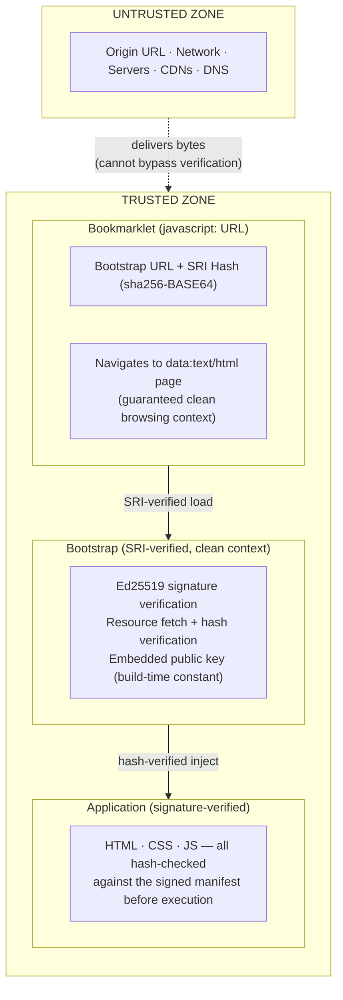
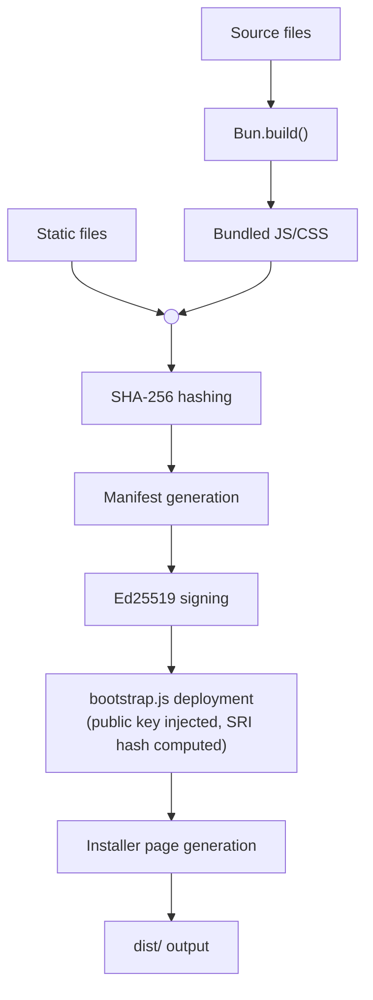

# Design Document: markproof

## Trust-Anchored Web Application Loader

### Revision History

| Date | Description |
|------|-------------|
| 2026-02-20 | Initial design document |
| 2026-02-20 | Rewrite: data-URL bookmarklet architecture |

---

## 1. Problem Statement

Standard web applications place their root of trust in a URL. The browser fetches code from a server, and the user trusts that server to deliver the correct code. This model breaks catastrophically when:

- The domain expires and is re-registered by a new party
- The server is compromised by an attacker
- A government seizes the domain or coerces the hosting provider
- A CDN or DNS provider is compromised
- A certificate authority issues a fraudulent TLS certificate

In all of these cases, the attacker can serve arbitrary JavaScript to every user who visits the URL. Service workers do not help — the browser's SW update lifecycle will eventually install the attacker's replacement, and once all tabs close, the new SW takes full control.

**markproof solves this by moving the root of trust from the server to a client-side artifact: a JavaScript bookmarklet.**

### Threat Model

| Actor | Capabilities |
|-------|-------------|
| State-level adversary | Valid TLS certs, DNS hijacking, domain seizure, server compromise, legal compulsion of hosting/CA providers |
| Network attacker | MITM (defeated by TLS, but see above), DNS poisoning |
| Compromised origin | Arbitrary JS execution in the page context before the bookmarklet runs |

**Trusted components:**
- The browser engine (standards-compliant, uncompromised)
- The bookmarklet content (installed from an uncompromised source, immutable after creation)
- The Ed25519 signing key (held offline or compartmentalized; not compromised alongside the server)

**Explicitly untrusted:**
- The origin URL (the page served at the URL the bookmarklet navigates from)
- All network-fetched content (until cryptographically verified)

**Key assumption:** The signing key must remain offline or otherwise compartmentalized from the server infrastructure. If the signing key is compromised (e.g., stored on the same server that is breached), the attacker can produce validly signed content and the protection is defeated. This means markproof is suitable for **static, offline-signed content** but **not for dynamic server-generated content** where the key would need to reside on the server.

---

## 2. Architecture Overview

### 2.1 The Three Components



### 2.2 Chain of Trust

The security of the system rests on a three-link chain:

1. **Bookmarklet → Clean Context**: The bookmarklet navigates the browser to a `data:text/html` URL. This creates a brand-new browsing context with an opaque origin, completely isolated from the compromised page. The browser engine guarantees this isolation — no JavaScript from any other context can reach into a data-URL page.

2. **Clean Context → Bootstrap**: Inside the data-URL page, a `<script>` tag loads the bootstrap with a browser-native SRI (Subresource Integrity) `integrity` attribute. The browser verifies the SHA-256 hash of the fetched script before execution. An attacker cannot make different content pass the SRI check.

3. **Bootstrap → Manifest → Resources**: The bootstrap runs in the verified clean context and uses the browser's native `crypto.subtle` to verify the Ed25519 signature on the application manifest. The signing public key is embedded in the bootstrap (which was SRI-verified in step 2). Each resource listed in the manifest is then fetched and hash-verified before use.

### 2.3 Why a Data-URL Bookmarklet?

#### The Clean Context Problem

A previous iteration of markproof attempted to create a clean execution context by exploiting non-configurable property chains (`window.document` → `createElement('iframe')` → `contentWindow`). After exhaustive research, this approach was abandoned because **no complete chain of non-configurable properties exists** from the page context to a clean iframe across all browsers. An attacker who controls the page can intercept configurable links in the chain and substitute a fake "clean context."

The data-URL approach sidesteps this entirely. Navigating to `data:text/html,...` creates a new top-level browsing context — the browser starts fresh, with its own set of built-in objects, completely unreachable from the previous page.

#### Why Not Other Approaches?

| Alternative | Why It Fails |
|------------|-------------|
| Service Worker | Browser controls update lifecycle; server controls SW content |
| localStorage/sessionStorage | Accessible (and writable) by any JS running on the origin |
| Browser extension | Requires extension store trust; store could be compelled to remove |
| Native app wrapper | Requires app store approval; policy restrictions on dynamic code |
| TLS certificate pinning | Defeated by compromised CAs or legal compulsion |
| Subresource Integrity (SRI) alone | Only works for `<script>` tags in HTML; HTML itself is unverified |
| Clean iframe via property chains | No guaranteed non-configurable chain across browsers |

A `data:text/html` bookmarklet is:
- **Client-side**: Stored in the browser, not fetched from a server
- **Immutable**: Cannot be modified after creation (no API to read or write bookmark content from page JS)
- **Server-independent**: No server can alter it
- **Context-isolating**: Navigates to a guaranteed clean browsing context
- **Portable**: Just a text string — can be backed up in a password manager, printed, etc.

---

## 3. Clean Context via Data URL

### 3.1 How It Works

When the bookmarklet executes `location.href = 'data:text/html;charset=utf-8,...'`, the browser:

1. Destroys the current page context entirely
2. Creates a new top-level browsing context
3. Assigns the data-URL page an **opaque origin** (not `null`, but a unique internal origin)
4. Parses and renders the HTML content from the data URL
5. Executes any scripts in the new context

The new context has:
- Its own set of pristine built-in objects (`Object`, `Array`, `Promise`, `crypto`, etc.)
- No connection to the previous page's JavaScript heap
- No access to any origin-scoped storage (IndexedDB, localStorage, cookies)

### 3.2 Implications of the Opaque Origin

The opaque origin means the data-URL page cannot access any storage tied to the original web app's origin:

- **No IndexedDB**: Cannot read or write cached resources
- **No localStorage/sessionStorage**: Cannot persist any state
- **No cookies**: Cannot maintain sessions

This means markproof **cannot provide offline capability**. Every launch requires a network fetch of the manifest and resources. However, standard HTTP caching (via `Cache-Control`, `ETag`, `Last-Modified` headers) is handled transparently by the browser and can significantly reduce redundant network transfers. This is orthogonal to markproof's trust guarantees.

### 3.3 SRI-Based Bootstrap Verification

The data-URL page contains a `<script>` tag with the SRI `integrity` attribute:

```html
<script src="https://example.com/bootstrap.js"
        integrity="sha256-BASE64HASH"
        crossorigin="anonymous"></script>
```

The browser's native SRI implementation:
1. Fetches the script from the specified URL
2. Computes the SHA-256 hash of the response body
3. Compares it to the hash in the `integrity` attribute
4. Executes the script only if the hashes match
5. Fires an `error` event if they don't match

This is equivalent to manual hash verification but delegated to the browser engine — no custom SHA-256 implementation needed.

**Note:** SRI requires the `crossorigin="anonymous"` attribute because the data-URL page's opaque origin makes all fetches cross-origin. The server hosting `bootstrap.js` must serve CORS headers (`Access-Control-Allow-Origin: *`). GitHub Pages does this by default.

### 3.4 Security of the Bookmarklet Itself

The bookmarklet runs in the compromised page's context before navigating away. It calls `encodeURIComponent` (potentially poisoned) and `location.href` assignment. A poisoned `encodeURIComponent` can only:
- Produce a malformed data URL → browser won't navigate (denial of service)
- Produce a valid data URL with different HTML content → the SRI hash on the `<script>` tag won't match the bootstrap, so no attacker code executes

Neither outcome allows the attacker to run unverified code. The worst case is denial of service, which the attacker could achieve anyway by simply not serving the page.

### 3.5 Trust Anchor Reset on Bookmarklet Installation

Every bookmarklet installation is a **trust anchor reset**. The user is placing their trust in whatever entity currently controls the content at the installer URL. This has critical implications:

1. **Compromised installer page**: If the server is compromised at the time of bookmarklet installation, the user will receive a bookmarklet anchored to the attacker's keys. A compromised server that still displays the installer page is **visually indistinguishable** from a legitimate one — the page's appearance is not trustworthy.

2. **Signature failure messaging**: The bookmarklet and bootstrap must clearly communicate that a **signature verification failure may indicate server compromise**. Users must understand that even if the server appears to still be serving the "install bookmarklet" page, the integrity of that page cannot be trusted. The only trustworthy signal is successful cryptographic verification.

3. **TOFU model**: This follows a "trust on first use" model analogous to SSH host key verification. The initial installation must occur from an authentic, uncompromised source. All subsequent loads are verified against that trust anchor. Users should verify the source through out-of-band channels when possible.

4. **Re-installation risk**: Any time a user installs a new bookmarklet, they are discarding their previous trust anchor and accepting a new one from whatever entity currently controls the URL. Users must understand this implication before re-installing.

---

## 4. Update Modes

markproof supports two update behaviors, chosen at install time:

### 4.1 Mode A: Locked (Version-Pinned)

The bookmarklet embeds both the bootstrap SRI hash and the SHA-256 hash of the canonical manifest. The application is pinned to an exact version.

- **Author-signed updates are rejected** — even valid signatures are refused if the manifest hash differs
- **Update path**: Requires generating a new bookmarklet with new hashes. The user must explicitly re-install.
- **Use case**: Maximum security. The application is frozen at a known-good version.

### 4.2 Mode B: Auto-Update (Author-Signed)

The bookmarklet embeds only the bootstrap SRI hash. The bootstrap accepts any manifest with a valid Ed25519 signature from the embedded public key.

- **Author-signed updates are accepted automatically**
- **Use case**: Convenience with trust. The user trusts the author's signing key and accepts signed updates. A server compromise by a non-key-holder cannot influence the application — only cause denial of service.

### 4.3 Manifest Structure

```json
{
  "version": "1.2.0",
  "timestamp": "2026-02-20T12:00:00Z",
  "resources": {
    "/app.html": {
      "hash": "sha256-39df1931...",
      "size": 394,
      "urls": [
        "https://example.github.io/myapp/app.html",
        "https://unpkg.com/myapp@1.2.0/app.html"
      ]
    },
    "/app.js": {
      "hash": "sha256-fe860513...",
      "size": 12345
    },
    "/style.css": {
      "hash": "sha256-668a7eb2...",
      "size": 400
    }
  },
  "signature": "96a30b73bde5a2da..."
}
```

**Only the manifest is signed.** All other resources are verified by their hashes listed in the manifest. The `urls` field provides optional alternative fetch URLs for CDN delivery but is excluded from the canonical form used for signing (it's a delivery hint, not integrity data).

---

## 5. Build System (Bun Plugin)

### 5.1 Plugin API

```typescript
import { buildApp } from 'markproof/plugin';

await buildApp({
  entrypoints: ['./src/app.ts'],
  staticFiles: ['./src/index.html', './src/style.css'],
  outdir: './dist',
  minify: true,

  appName: 'My App',
  version: '1.0.0',
  originUrl: 'https://myname.github.io/myapp',
  privateKey: process.env.SIGNING_PRIVATE_KEY,

  installer: {
    template: './src/installer.html',
    generatorEntrypoint: './src/installer.ts',
  },
});
```

### 5.2 Build Pipeline



### 5.3 Key Management

```bash
# Generate a new Ed25519 keypair
bun run src/plugin/keygen.ts

# Output:
#   PRIVATE KEY (PEM) — store as GitHub secret SIGNING_PRIVATE_KEY
#   PUBLIC KEY (base64 SPKI) — set as PUBLIC_KEY secret or env var
```

The private key never appears in the repository. The public key is embedded in the bootstrap script at build time (before the SRI hash is computed).

**Critical:** The private signing key must be held offline or compartmentalized from the deployment infrastructure (e.g., stored only as a CI secret, never on the production server). If the signing key is compromised alongside the server, the attacker can produce validly signed malicious content, defeating the protection entirely. markproof's security guarantee assumes the signing key and the serving infrastructure have independent compromise boundaries.

---

## 6. CDN-Friendly Resource Delivery

Because only the manifest is signed and individual resources are hash-verified, application assets can be served from **any CORS-enabled host**. The bootstrap fetches the resource, computes its SHA-256 hash, and verifies it matches the manifest entry. The server delivering the bytes is completely untrusted.

---

## 7. Security Analysis Summary

### What Is Proven

| Property | Mechanism | Guarantee Level |
|----------|-----------|----------------|
| Clean execution context | data-URL navigation (opaque origin) | **Browser engine guarantee** |
| Bootstrap integrity | Browser-native SRI (SHA-256) | **Cryptographic** |
| Manifest authenticity | Ed25519 signature verification | **Cryptographic (assumes signing key uncompromised)** |
| Resource integrity | SHA-256 hash verification against signed manifest | **Cryptographic** |
| Bookmarklet immutability | Browser bookmark storage (no JS API to read/write) | **Platform guarantee** |
| Protection against server compromise | Signature verification rejects unsigned/re-signed content | **Cryptographic (assumes signing key held offline; DoS still possible)** |

### Known Limitations

1. **No offline capability**: Opaque origin has no storage access. Standard HTTP caching is the only optimization.
2. **CORS requirement**: All resources must serve `Access-Control-Allow-Origin: *`.
3. **Key rotation**: Requires distributing new bookmarklets.
4. **Bookmarklet loss**: Must re-install from a trusted source — and any re-installation resets the trust anchor to whoever currently controls the installer URL.
5. **Data-URL support**: Requires browser support for `javascript:` bookmarklets and `data:` URL navigation.
6. **Static content only**: The signing key must be held offline/compartmentalized to maintain the security guarantee. This means markproof is not suitable for dynamic server-generated content, where the signing key would need to be accessible to the server (and would therefore be compromised alongside it).
7. **Denial of service**: A server compromise cannot cause execution of unverified code, but can cause denial of service by serving content that fails verification. The protection is against *influence*, not *availability*.
8. **Trust on first use**: The initial bookmarklet installation must occur from an uncompromised source. A compromised server can serve an attacker-controlled installer page that is visually indistinguishable from the legitimate one.

---

## 8. Comparison with Related Work

| Approach | Trust Root | Protects Against Server Compromise? | Clean Context? |
|----------|-----------|--------------------------------------|----------------|
| Standard HTTPS | Server TLS cert | No | N/A |
| Service Worker + Cache | SW file on server | No (SW update replaces it) | N/A |
| Subresource Integrity | `<script integrity>` in HTML | No (HTML itself is unverified) | N/A |
| Browser extension | Extension store | Partially (store could remove) | Yes |
| **markproof** | **Client-side bookmarklet** | **Yes (DoS still possible; requires offline signing key)** | **Yes (data-URL)** |

---

## 9. Future Work

- **Key hierarchy**: Root key in bookmarklet signs delegate/rotation keys, allowing key rotation without new bookmarklets
- **Multi-signature**: Require M-of-N signatures on manifests for high-security deployments
- **Browser extension companion**: Optional extension that could provide origin-scoped storage for verified resources (recovering offline capability)
- **iOS compatibility testing**: Verify data-URL bookmarklet behavior across iOS Safari versions
- **Dependency scanning and static analysis**: Automated CI checks for known vulnerabilities in dependencies and static analysis of the bootstrap and bookmarklet code to catch regressions
